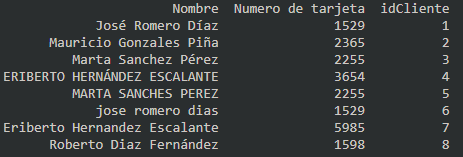

# **[Test 1](#primer-test)**
# **[Test 2](#segundo-test)**

# **Primer Test**

- Explica qué proceso realiza el algoritmo.
- ¿Cuáles son los casos que no se consideran en el algoritmo?
- Completa el código para considerar los casos que no se toman en cuenta.

~~~py
a = 2
b = 1
c = 3

lista = [a, b, c]

if a > b and a > c:
    if b > c:
        lista = [a, b, c]

    if c > b:
        lista = [a, c, b]

    print(lista)

elif b > a and b > c:
    if a > c:
        lista = [b,a,c]

    if c > a:
        lista = [b,c,a]

    print(lista)

elif c > a and c > b:
    if a > b:
        lista = [c,a,b]

    if b > a:
        lista = [b,c,a]

    print(lista)
~~~

## **Proceso que realiza el código**
El algoritmo compara 3 variables con valores numéricos para poder determinar cual es el de mayor y el de menor valor, posteriormente ordenarlos en una lista e imprimirlos en pantalla.

## **¿Casos que no se consideraron?**

El algoritmo funciona de manera correcta solo si los 3 valores son diferentes entre si ya que no esta considerando los casos en el que los valores se lleguen a repetir más de una vez. Para poder solucionar esto bastara con cambiar `>` por `>=` de esta forma ya se estaría considerando que los valores podrían ser iguales.

Quedando el algoritmo de la siguiente manera:

~~~py
a = 2
b = 1
c = 3

lista = [a, b, c]

if a >= b and a >= c:
    if b >= c:
        lista = [a, b, c]

    if c >= b:
        lista = [a, c, b]

    print(lista)

elif b >= a and b >= c:
    if a >= c:
        lista = [b,a,c]

    if c >= a:
        lista = [b,c,a]

    print(lista)

elif c >= a and c >= b:
    if a >= b:
        lista = [c,a,b]

    if b >= a:
        lista = [b,c,a]

    print(lista)
~~~

## **Soluciones alternativas**

- a >= b and b >= c
- a >= c and c >= b

- b >= a and a >= c
- b >= c and c >= a

- c >= b and b >= a
- c >= a and a >= b

Dándonos otra posible solución para ordenar 3 valores numéricos.

~~~py
a = 2
b = 1
c = 3

lista = [a, b, c]

if a >= b and b >= c:
lista = [a, b ,c]
if a >= c and c >= b:
lista = [a, c ,b]

if b >= a and a >= c:
lista = [b, a, c]
if b >= c and c >= a:
lista = [b, c , a]

if c >= b and b >= a:
lista = [c, b, a]
if c >= a and a >= b:
lista = [c, a, b]

print(lista)
~~~

Al estar trabajando con lista en Python es posible hacer uso de algunas funciones que nos permiten manipular el contenido de una lista dando una posible solución para ordenar los valores como se muestra a continuación.

~~~py
a = 2
b = 1
c = 3

lista = [a,b,c]

lista.sort() #ordena los valores de menor a mayor
print('De menor a mayor: '+str(lista))
lista.reverse() #invierte los valores de la lista
print('De mayora menor: '+str(lista))
~~~

- - -

# **Segundo Test**

- Para este ejercicio necesitas hacer uso del documento nombrado Tabla1.
- Escribe un algoritmo para consolidar los registros en uno solo los registros encontrados en Tabla1.
- Usa el documento Tabla1 para generar la salida.

Se hizo uso la librería de pandas para poder manipular los datos del archivo `Tabla1.csv`.

Datos originales del archivo `Tabla1.csv`

### **Código**
~~~py
import pandas as pa

datos = pa.read_csv('Tabla1.csv', header=0, encoding='latin-1')
print(datos)
data = pa.DataFrame(datos)

data['Nombre'] = data['Nombre'].str.title()

texto_1 = ['Jose','Joce','Jocé','Jóce','Jóse']
texto_2 = ['Dias','Diaz','Diás','Diáz']
texto_3 = ['Hernandez','Hernandes']
texto_4 = ['Gonzales','Gonsales','Gonzalez','Gonsalez']
texto_5 = ['Sanchez','Sanches']
texto_6 = ['Peres','Perez','Péres']

def corregir(texto_o, texto_c):
  for i in texto_o:
    data['Nombre'] = data['Nombre'].str.replace(i, texto_c)

corregir(texto_1, 'José')
corregir(texto_2, 'Díaz')
corregir(texto_3, 'Hernández')
corregir(texto_4, 'González')
corregir(texto_5, 'Sánchez')
corregir(texto_6, 'Pérez')

dataf = data.groupby(by=['Nombre'])['idCliente'].unique()
dataa = data.groupby(by='Nombre')['Numero de tarjeta'].unique()
datafinal = pa.concat([dataa, dataf], axis=1)
datafinal['Nombre'] = datafinal.index
index_new = []

for i in range(len(datafinal)):
  index_new.append(i)

datafinal.index = index_new

print()
print(datafinal[['Nombre','Numero de tarjeta','idCliente']]) 
~~~

### **Salida del código**
